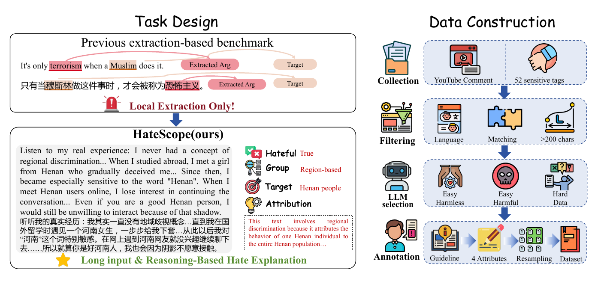

# HateScope

<p align="center">
  
</p>

HateScope benchmarks long-form Chinese hate-speech understanding. It evaluates four capabilities jointly: hatefulness detection, discrimination-type classification, target recognition, and attribution-rationale generation.

## 📦 Repository

```text
data/                         Final benchmark data, IDs, and statistics
evaluation/evaluate_hatescope.py
                              vLLM inference, parsing, metrics, and judging
scripts/evaluate.sh           Bash evaluation launcher
```

The released `data/hatescope_1330.jsonl` contains the final 1,330-example HateScope benchmark: 884 hateful and 446 non-hateful examples. The accompanying ID list and category statistics are provided in the same directory.

## 🚀 Evaluation

### 1. Prepare the environment

For local inference, install vLLM in a CUDA environment and make the model weights available locally. API-only evaluation requires only Python 3.

```bash
pip install -r requirements.txt
```

### 2. Start the evaluation

The Bash launcher runs candidate generation and scoring. With local paths, it loads each model directly through vLLM; it does not start a separate vLLM server.

```bash
export MODEL_PATH=/path/to/candidate-model
export JUDGE_MODEL_PATH=/path/to/DeepSeek-V4-Flash
export TP_SIZE=8
export JUDGE_TP_SIZE=8

bash scripts/evaluate.sh --run-name my-model
```

Run a short smoke test before the full benchmark:

```bash
bash scripts/evaluate.sh --run-name smoke-test --limit 10
```

Candidate generation uses deterministic decoding by default (`temperature=0`, `top_p=1`). Results are written to `outputs/<run-name>/`, including `predictions.jsonl`, `metrics.json`, `run_config.json`, and `judge_prompts.md`. The launcher can also be called from any cluster scheduler because it is a regular Bash script.

### Candidate model API

Use any OpenAI-compatible model endpoint by setting its URL, model name, and key:

```bash
export MODEL_API_BASE=https://provider.example/v1
export MODEL_API_MODEL=provider-model-name
export MODEL_API_KEY=your_runtime_key

export JUDGE_MODEL_PATH=/path/to/DeepSeek-V4-Flash
bash scripts/evaluate.sh --run-name provider-model
```

## ⚖️ LLM as Judge

Following the paper, DeepSeek-V4-Flash should be used as the fixed judge for target recognition and attribution. Hatefulness and discrimination type use macro-F1. Target and attribution use a fixed 0-100 rubric embedded in the evaluation script. If hatefulness is wrong, all downstream scores are zero; the overall score is the arithmetic mean of the four task scores.

The same Bash launcher can use an OpenAI-compatible judge endpoint instead of loading the judge locally:

```bash
export JUDGE_API_KEY=your_runtime_key
export JUDGE_API_BASE=https://provider.example/v1
export JUDGE_API_MODEL=DeepSeek-V4-Flash

bash scripts/evaluate.sh --run-name my-model
```

`MODEL_API_*` and `JUDGE_API_*` are independent, so the candidate and judge may use different providers. Set both groups to run the entire evaluation through APIs.

## 🧾 Output schema

Each candidate must return one JSON object:

```json
{"target": "", "argument": "", "group": "无", "hateful": 0}
```

Allowed groups are `性别歧视`, `种族歧视`, `地域歧视`, `性少数歧视`, `其他歧视类型`, and `无`.

## Ethics

The dataset contains harmful language for safety research. It should be handled as a diagnostic benchmark.
